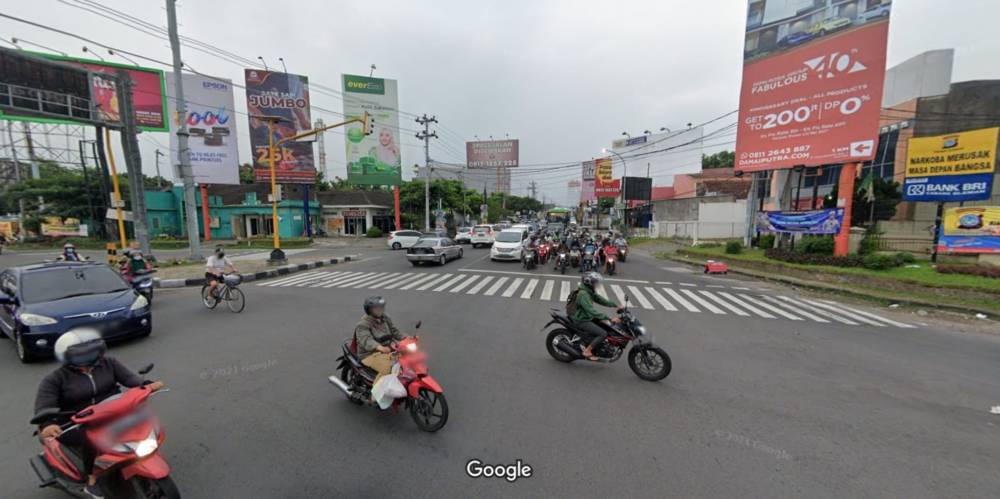
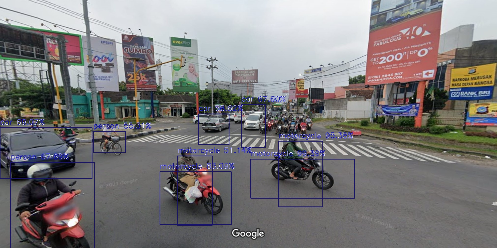

# imageAI-ObjectDetection
A python library to build applications and systems with self-contained Computer Vision capabilities.

note: Install all dependencies before you start                    
https://github.com/OlafenwaMoses/ImageAI/#dependencies

With state-of-the-art deep learning algorithms like RetinaNet, YOLOv3, and TinyYOLOv3, ImageAI can accomplish all of these. You may use ImageAI to do picture analysis and detecting tasks.

Pre-trained dataset model  
[RetinaNet Model - resnet50_coco_best_v2.1.0.h5](https://github.com/OlafenwaMoses/ImageAI/releases/download/essentials-v5/resnet50_coco_best_v2.1.0.h5/)  
[YOLOv3 Model - yolo.h5](https://github.com/OlafenwaMoses/ImageAI/releases/download/1.0/yolo.h5/)  
[TinyYOLOv3 Model - yolo-tiny.h5](https://github.com/OlafenwaMoses/ImageAI/releases/download/1.0/yolo-tiny.h5/)

# Demos

Original image             |  Result
:-------------------------:|:-------------------------:
  |  

